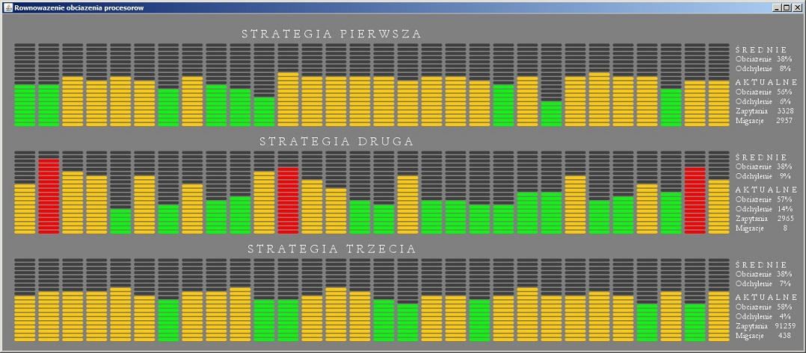

  

 
<h1> Systemy operacyjne </h1>
<h2> Zadanie 5 - Symulacja rozproszonego algorytmu równoważącego obciążęnie procesorów </h2>

W systemie pracuje N identycznych procesorów. Na każdym z nich pojawiają się nowe zadania (procesy), z RÓŻNĄ częstotliwością i RÓŻNYMI wymaganiami (każdy proces wymaga określonego, różnego,  udziału w mocy obl. procesora - np ~3%). Zasymulować nast. strategie przydziału:

Na procesorze x pojawia sie zadanie. Nastepnie:

1. x pyta losowo wybr. procesor y o aktualne obciążenie. Jeśli jest mniejsze od progu p, proces jest tam wysyłany. Jeśli nie, losujemy i pytamy następny, próbując co najwyżej z razy. Jeśli wszystkie wylosowane są obciążone powyżej p, proces wykonuje się na x. 

2.Jesli obciążenie x przekracza wartość progową p, proces zostaje wysłany na losowo wybrany procesor y o obciążeniu mniejszym od p (jeśli wylosowany y ma obc.>p, losowanie powtarza się do skutku). Jeśli nie przekracza - proces wykonuje się na x.

3.Jak w pkt 2, z tym że procesory o obciążeniu mniejszym od minimalnego progu r pytają losowo wybrane procesory i jesli obc. zapytanego jest większe od p, pytający przejmuje część jego zadań (założyć jaką).

Przeprowadzić symulację strategii 1-3 dla N=ok.50-100 i długiej serii zadań do wykonania (parametry dobrać samodzielnie, tak by całość zadziałała:). W każdym przypadku podać jako wynik:
A. Średnie obciążenie procesorów (zdecydować, rozsądnie, jak będzie obliczane).
B. Średnie odchylenie od wartości z pkt A.
C. Ilość zapytań o obciążenie oraz migracji (przemieszczeń) procesów.

Użytkownik powinien mieć możliwość podania (zmiany) wartości p,r,z,N.
